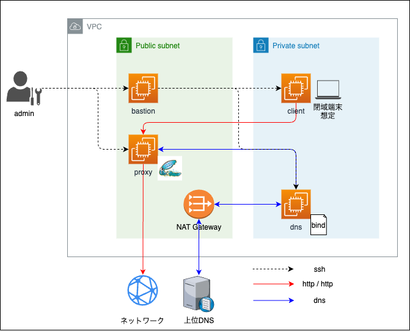

# shibaProxy
[こちらの記事](https://qiita.com/yabish/private/64c3e7843cbaf33dd9e4)に記載しているリポジトリです。 
閉域NWでのProxy, DNSを構築するためのcfnをまとめています。

## アーキテクチャ

## 使用上の注意
各リソースともに、 `parameter.<リソース名>.json` が必要になります。 
必要なパラメータに関しては、 `template.<リソース名>.json` の `Parameters` からご確認ください。